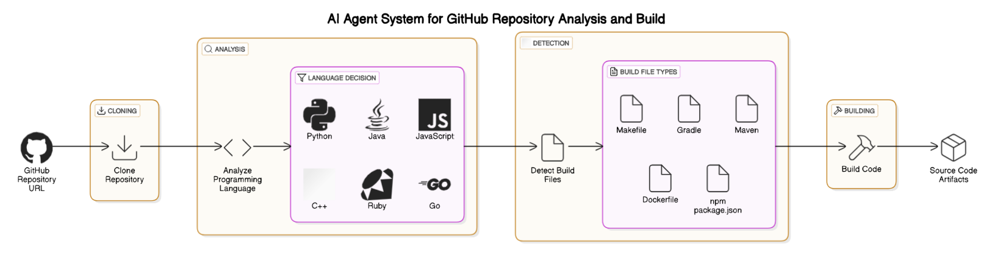

# Agentic AI Framework POC using AutoGen

This repository demonstrates a Proof of Concept (POC) implementation of an Agentic AI framework using Microsoft's AutoGen library. The project showcases autonomous agents working together to perform code repository operations.

## Features

- **Repository Cloning**: Automatically clones Git repositories using the [`RepoCloner`](build.py) agent
- **Language Detection**: Analyzes repositories to detect primary programming languages using the [`RepoAnalyzer`](build.py) agent
- **Automated Building**: Builds projects based on detected language and build configuration using the [`CodeBuilder`](build.py) agent

## Supported Languages & Build Systems

- Java (Maven/Gradle)
- React/Node.js (npm)
- Python (pip, setup.py, poetry)
- Ruby (Bundler)
- C++ (CMake, Make)

## Prerequisites

- Python 3.x
- Git
- Language-specific build tools (Maven, npm, etc.)
- Required Python packages:
  - autogen
  - python-dotenv
  - gitpython

## Configuration

Create a `.env` file with your Azure OpenAI credentials:
```env
AZURE_API_KEY=your_api_key
AZURE_API_BASE=your_base_url
AZURE_API_VERSION=your_api_version

## Architecture Diagram


